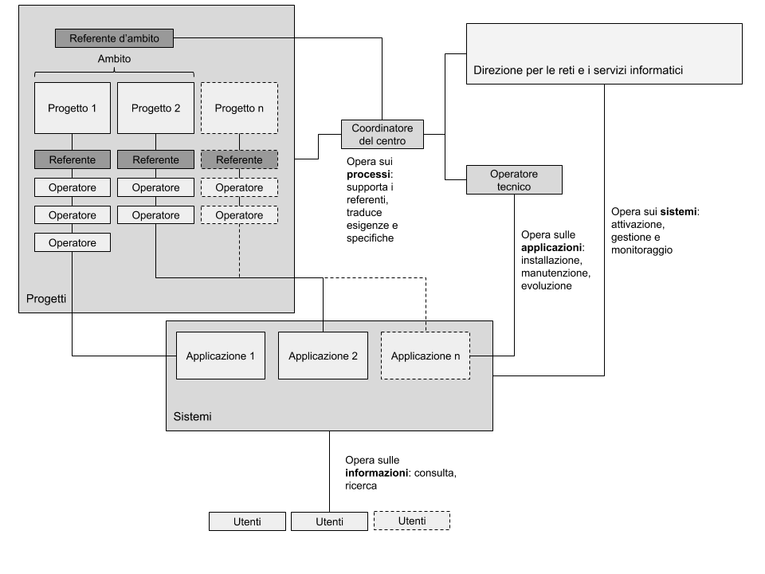

## Documentazione per il centro dh.unica.it

### Strumenti per

## Organizzazione del centro

### Figure coinvolte e ruoli

*   Utente visitatore: è l’utente anonimo (ovvero non ha alcuna autenticazione nei sistemi di unica) ed accede al portale con lo scopo di consultare le pagine web pubbliche relative ai progetti ed alle iniziative del dipartimento come ad esempio uno studente dello stesso ateneo. Normalmente giunge dopo una ricerca sui motori di ricerca o dalla home page del portale unica.it .
*   Utente operatore: è l’utente in possesso di credenziali d’accesso in uno delle applicazioni utilizzate nel portale dh.unica.it . Fa parte di almeno di gruppo di lavoro, partecipa attivamente ad un progetto inserendo ed elaborando informazioni nel sistema. La sua attività è coordinata da un referente di progetto.
Referente di progetto: è l’utente a cui fa capo l’attività di uno o più progetti. Dispone anch’esso di credenziali di accesso nei sistemi applicativi di unica.it ma dispone di permessi tali da poter abilitare all’accesso altri utenti, tipicamente partecipanti al progetto.
Referente d’ambito: è l’utente referente di uno specifico ambito. Coordina le attività dei diversi progetti in diretta relazione con i referenti. Dialoga con il coordinatore del centro per risolvere specifiche questioni tecniche o per richiedere l’attivazione di nuovi progetti.
Coordinatore del centro: che coordina le attività per l’attivazione e la gestione delle applicazioni relative ai progetti. Dialoga direttamente con i referenti di progetto e i referenti d’ambito supportandoli nella scelta degli strumenti informatici, nell’attivazione di nuovi progetti e nella definizione di attività o specifiche per la loro manutenzione o evoluzione. E’ inoltre il referente che dialoga con la Direzione per le reti e i servizi informatici.
Operatore tecnico: è il referente del soggetto individuato da unica per l’esecuzione delle attività tecniche informatiche sulle applicazioni residenti nei sistemi. Ha il compito di eseguire le attività di installazione, manutenzione ed evoluzione delle applicazioni secondo quanto descritto nelle richieste del referente di dipartimento. Supporta quest’ultimo nella progettazione di nuove soluzioni a supporto degli utenti e di tutto il personale coinvolto.

